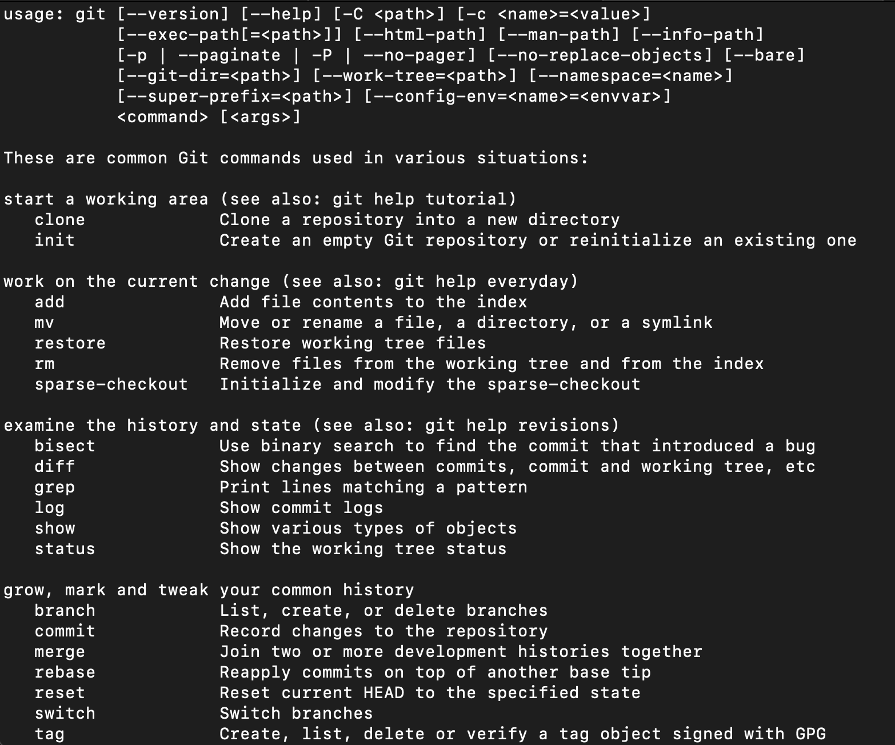
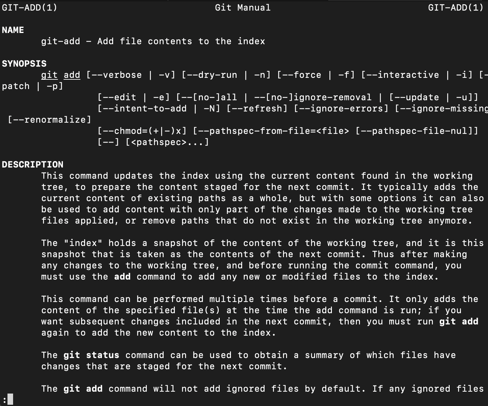
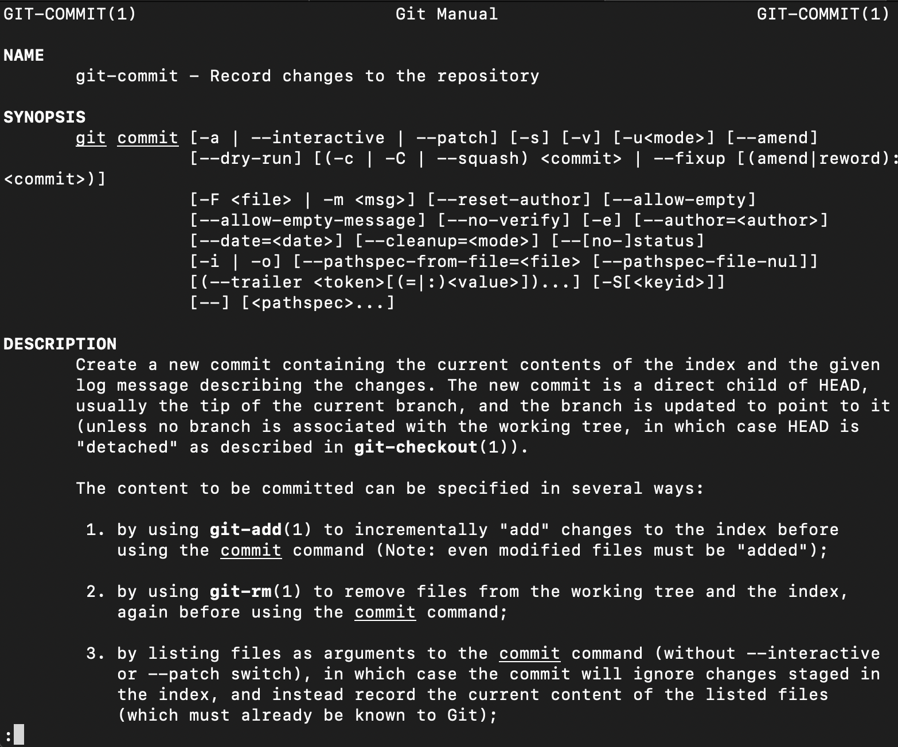
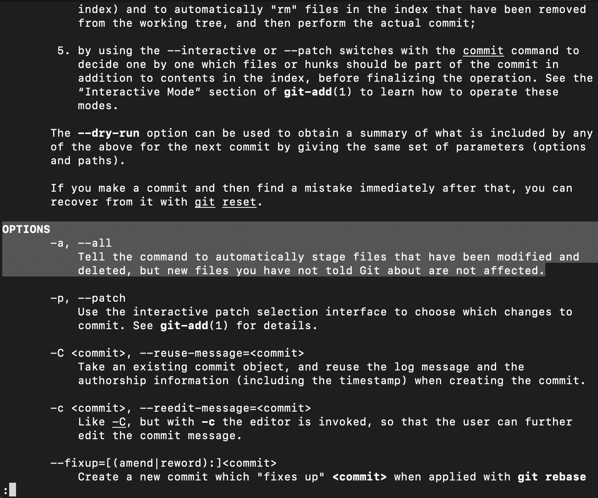

# Bash and Git - Recap

## Introduction

In this section you took a look at how Git is used for collaboration as part of a development team. This started by practicing navigating directories using the command line and continued by further investigating Git commands. You also practiced creating and maintaining Git repositories including adding, committing, and pushing changes. You saw how to make multiple branches and then merge changes back into the master branch. You also saw how to navigate merge conflicts when the same line of the same file has been edited in both branches trying to be merged. Make sure you continue to head back to the PEP8 and Git documentation for clarification, review, and learn more commands and arguments or style suggestions. 

## Bash and the command line

Recall some of our primary tools for navigating the command line: `cd`, `ls`, `pwd`, `mkdir`, and `nano`. You can use `cd ..` to move up a directory level and `cd ~/Documents` for folders starting at the user's home directory. You can use `ls -a` to view hidden files and `ls -la` for a long listing of all files. (Again the `l` argument is for long form and the `a` in both cases for all files, including those beginning with `.`, indicating that they are hidden.) You can also make directories with the `mkdir` command. You saw how to use `nano` to make and edit files from the command line. Other editors such as emacs and vim can be worthwhile if you are doing more substantial command line editing. 

## Git

Remember that Git was not only designed as a version control system, but a means for collaborative development. It was originally released in 2005 by Linus Torvalds, to help facilitate development of the Linux kernel. While there is still much to learn about Git, you saw some of the primary concepts all developers interact with when using Git to collaborate on projects. 

### Git commands

You've seen a decent amount of Git commands including `git add`, `git commit`, `git branch`, `git checkout`, and `git merge`. Also its important to know how to access documentation so that you can both review and extend your knowledge. For example, to see a list of git commands in general, start with `git --help`. 

You can also review individual commands with 'git help <command>' such as `git help add` (press `q` to quit the documentation.)

In the synopsis, you can see optional parameters such as in `git add --all` which you previously used before. 

Similarly, for the commit documentation, take a look at `git help commit` (and subsequently use `q` to quit.)

Here, you might notice additional arguments that you can begin to use, such as `a`, which you see listed in the synopsis.  Then, if you look under the options header, you will see a full description.

So for example, you could combine this with the `m` option as `git commit -am "your commit message"`. (Indeed this is a useful shortcut; by doing this you can bypass the `git add` command in your workflow in updating files being tracked by Git.)

At some point, you will also run into some trouble with Git and have merge conflicts or other idiosyncrasies between versions of your code. You have seen how Git annotates merge conflicts, and can also use `git stash` to temporarily store changes.

## Summary

Once again, preliminary tools such as the command line and Git are foundational to managing projects and maintaining code. Similarly, knowing how to access further information quickly is also an indispensable soft skill. Be sure to continue to organize work, modularize, and use version control. Also, keep PEP8 in mind and be thoughtful of how you organize, comment, and structure your code. All of these will make you a better programmer and Data Scientist.
